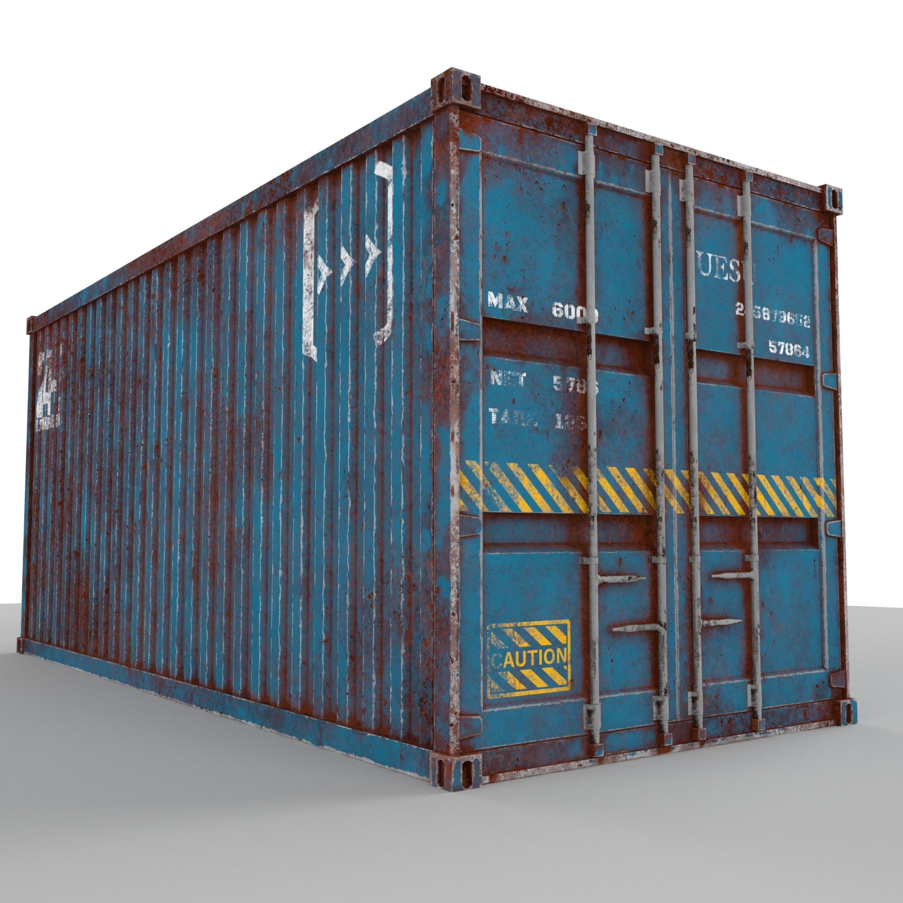
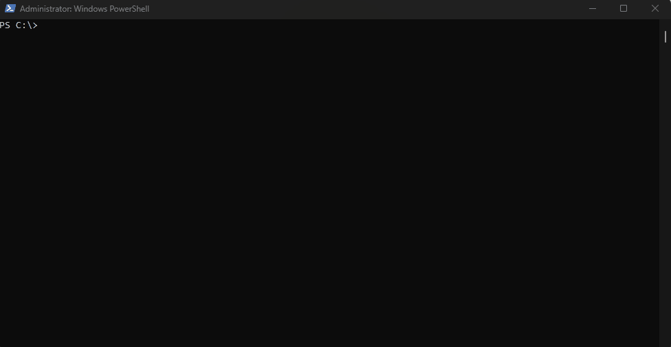

<b>Вступ</b><br>

<a href="./doc/Concept.md">Minikube, Kind, та k3d</a> - це інструменти для локального розгортання та управління кластерами Kubernetes. Кожен з цих інструментів має свої особливості та преимущества.

Minikube: Minikube дозволяє запускати одноузловий кластер Kubernetes на локальній машині. Він надає простий спосіб для тестування та розробки додатків, що працюють на Kubernetes. Можливості Minikube включають автоматичне розгортання кластеру, управління конфігурацією кластеру, відкриття доступу до ресурсів кластеру через командний рядок.

Kind: Kind (або Kubernetes in Docker) дозволяє запускати локальний багатоузловий кластер Kubernetes в середовищі Docker. Він використовує контейнери Docker як вузли кластеру, що спрощує процес розгортання та тестування додатків. Kind також дозволяє налаштовувати різні аспекти кластеру, такі як кількість вузлів, версія Kubernetes, мережа та інше.

k3d: k3d - це інструмент для запуску локального багатоузлового кластеру Kubernetes, використовуючи контейнери Docker. Він працює на основі K3s, легковагового варіанту Kubernetes, який підходить для використання на ресурсно обмежених системах. k3d надає зручні можливості для створення та управління кластером, включаючи масштабування, перенаправлення портів та налаштування мережі.

Інструкція для інсталяції на Linux:

Minikube:

Встановіть kubectl, якщо він відсутній: 
```bash
sudo apt-get install kubectl
```
Встановіть Hypervisor, наприклад, VirtualBox: 
```bash
sudo apt-get install virtualbox
```
Завантажте та встановіть Minikube: 
```bash
curl -LO https://storage.googleapis.com/minikube/releases/latest/minikube-linux-amd64 && sudo install minikube-linux-amd64 /usr/local/bin/minikube
```
Запустіть Minikube:
```bash
minikube start
```

Kind:

Встановіть Docker, якщо він відсутній: 
```bash
sudo apt-get install docker.io
```
Завантажте та встановіть Kind: 
```bash
curl -Lo ./kind https://kind.sigs.k8s.io/dl/v0.11.1/kind-linux-amd64 && chmod +x ./kind && sudo mv ./kind /usr/local/bin/kind
```
Створіть кластер Kind: 
```bash
kind create cluster
```

k3d:
Встановлення під Windows 10 Pro (перед інсталяцією потрібно встановити Docker Desktop)


Встановіть Docker, якщо він відсутній: 
```bash
sudo apt-get install docker.io
```

Завантажте та встановіть k3d: 
```bash
curl -s https://raw.githubusercontent.com/rancher/k3d/main/install.sh | bash
```
Створіть кластер k3d: 
```bash
k3d cluster create
```
Після виконання цих кроків ви повинні мати встановлені та запущені Minikube, Kind або k3d на своїй локальній машині. Ви можете використовувати їх для розробки, тестування та експериментів з Kubernetes.

Minikube, k3d і Kind є популярними інструментами для розгортання локальних кластерів Kubernetes. Кожен з цих інструментів має свої особливості та застосування, спрямовані на спрощення розробки, тестування та експериментування з Kubernetes.

Minikube - це легкий установщик, який дозволяє створити однокомпонентний кластер Kubernetes на вашому локальному комп'ютері. Він підтримує різні операційні системи і архітектури, що робить його доступним для широкого кола розробників. Minikube забезпечує повний контроль над кластером Kubernetes, дозволяючи налаштувати різні ресурси та експериментувати з різними функціями платформи. Він також надає можливості моніторингу та керування Kubernetes, що допомагає спростити розробку та тестування додатків.

k3d - це інструмент, який дозволяє швидко розгортати кластер Kubernetes у Docker контейнерах. Він покликаний забезпечити простоту встановлення та використання Kubernetes, заснованого на Docker. k3d дозволяє легко налаштовувати та масштабувати кластери, і він має гнучкі налаштування для використання в різних сценаріях розробки. Хоча він може мати меншу кількість налаштувань та функцій порівняно з іншими інструментами, k3d є привабливим варіантом для швидкого розгортання локального кластера Kubernetes у Docker.

Kind - це ще один інструмент для створення локальних кластерів Kubernetes. Він пропонує простоту встановлення та використання, а також використовує Docker контейнери для створення кластеру. Одна з відмінностей Kind полягає у його ефективному використанні ресурсів, що дозволяє створювати та управляти кластерами Kubernetes на основі Docker швидко і ефективно. Хоча Kind може мати обмежений набір налаштувань порівняно з іншими інструментами, він легко суміщується з іншими інструментами та розширюється згідно з вашими потребами.

<b>Висновок</b><br>
Всі ці інструменти - Minikube, k3d і Kind - надають зручний спосіб розгортання локальних кластерів Kubernetes, спрощуючи процес розробки, тестування та експериментування з цією платформою. Вибір конкретного інструменту залежить від вашого випадку використання, вимог до налаштування та функціональності, яку ви шукаєте.
