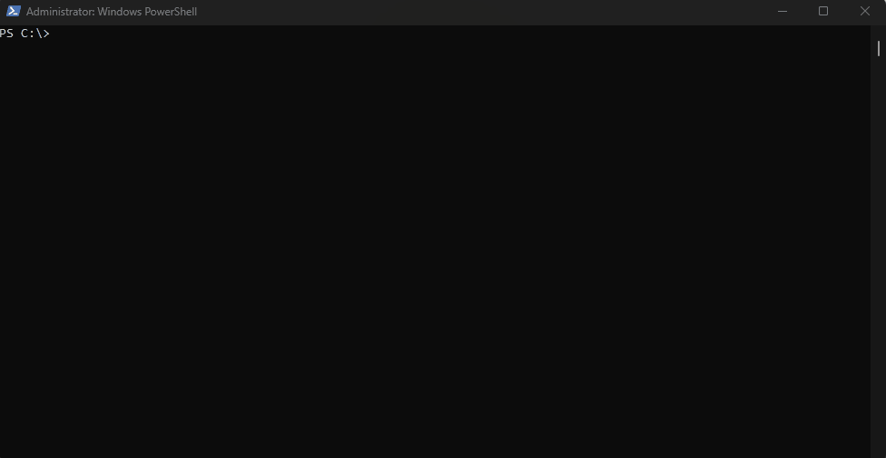

Інсталяція k3d на Windows 10 Pro.

<b>Таблиця з описом характеристики Minikube, k3d та Kind</b>
| Інструмент  | Підтримувані ОС та архітектури | Можливість автоматизації | Наявність додаткових функцій (моніторинг, керування Kubernetes) |
|-------------|--------------------------------|--------------------------|-----------------------------------------------------------------|
| Minikube	  | Windows, macOS, Linux          | Так                      | Підтримка моніторингу та керування Kubernetes                   |
|             | Архітектура x86-64, ARM64	   |                          |                                                                 |
| k3d         | Windows, macOS, Linux          | Так                      | Підтримка додаткових функцій через Kubernetes                   |
|             | Архітектура x86-64, ARM64	   |                          | (наприклад, моніторинг та керування)                            | 
| Kind	      | Windows, macOS, Linux	       | Так                      | Обмежена підтримка додаткових функцій, але можливість           |
|             | Архітектура x86-64, ARM64	   |                          | налаштування моніторингу та керування Kubernetes                |

<b>Таблиця з описом переваг та недоліків Minikube, k3d та Kind</b>
|             | Minikube                                     | k3d                             	            | Kind                                          |
|-------------|----------------------------------------------|----------------------------------------------|-----------------------------------------------|
| Переваги	  | Легкий установщик для локального кластера	 | Швидке розгортання і простота використання	| Простота встановлення і використання          |
|             | Kubernetes                                   | Kubernetes                                   | Kubernetes                                    |
|             | Висока стабільність роботи	                 | Гнучкі налаштування та масштабування	        | Ефективне використання ресурсів               |
|             | Широка підтримка документації та спільноти	 | Підтримка популярних опцій конфігурації	    | Легке суміщення з іншими інструментами        |
|             | Можливість налаштування різних ресурсів	     | Добра підтримка в Docker-середовищі	        | Підтримка багатьох опцій конфігурації         |
| Недоліки	  | Потребує більше ресурсів для роботи	         | Менша стабільність порівняно з Minikube	    | Менша кількість налаштувань для масштабування |
|             | Складніше налаштування та використання	     | Можуть виникати проблеми з деякими опціями	| Обмежений набір налаштувань                   |

