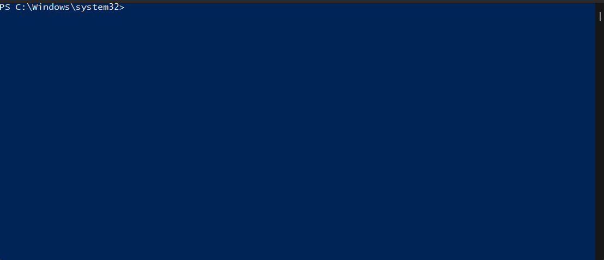

<a href="https://argo-cd.readthedocs.io/en/stable/">Argo CD</a> — це декларативний інструмент безперервної доставки GitOps для Kubernetes

Для того щоб розгорнути в локальному середовищі Argo CD, будемо використовувати k3d.
Інструкцію для налаштування k3d можна отримати в файлі <a href="https://github.com/AlbertRipak/AsciiArtify.git">README.md</a>.



# Create cluster
```bash
k3d cluster create demo
k3d cluster list
```

| NAME | SERVERS | AGENTS | LOADBALANCER |
|------|---------|--------|--------------|
| demo | 1/1     | 0/0    | true         |
# Install ArgoCD
```bash
kubectl create namespace argocd
kubectl apply -n argocd -f https://raw.githubusercontent.com/argoproj/argo-cd/stable/manifests/install.yaml
```
# Check pods
```bash
kubectl get pod -n argocd
```
| NAME                                             | READY | STATUS  | RESTARTS | AGE |
|--------------------------------------------------|-------|---------|----------|-----|
| argocd-redis-98fbb98fc-drxdd                     | 1/1   | Running | 0        | 65s |
| argocd-notifications-controller-79778bb4d6-cqsx9 | 1/1   | Running | 0        | 65s |
| argocd-application-controller-0                  | 1/1   | Running | 0        | 65s |
| argocd-applicationset-controller-975b88cf5-tn4lk | 1/1   | Running | 0        | 65s |
| argocd-dex-server-69b7d75d49-dkq96               | 1/1   | Running | 0        | 65s |
| argocd-repo-server-7477745f58-bnlw7              | 1/1   | Running | 0        | 65s |
| argocd-server-6b57d6598c-g9cbw                   | 1/1   | Running | 0        | 65s |

# Connect to ArgoCD
```bash
kubectl port-forward -n argocd svc/argocd-server 8080:443


kubectl get secret argocd-initial-admin-secret -n argocd -o yaml
# Change the password from the yaml file to your password
echo TkR4NUM5eEk0UWpOTUFGVw== | base64 -d
```